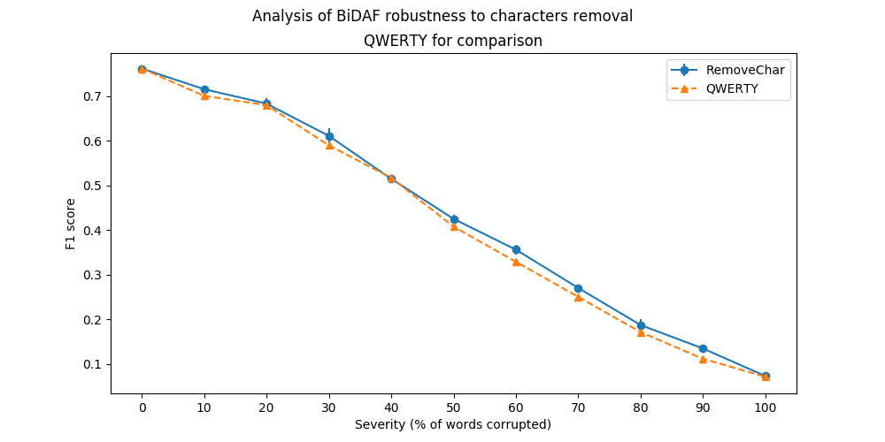
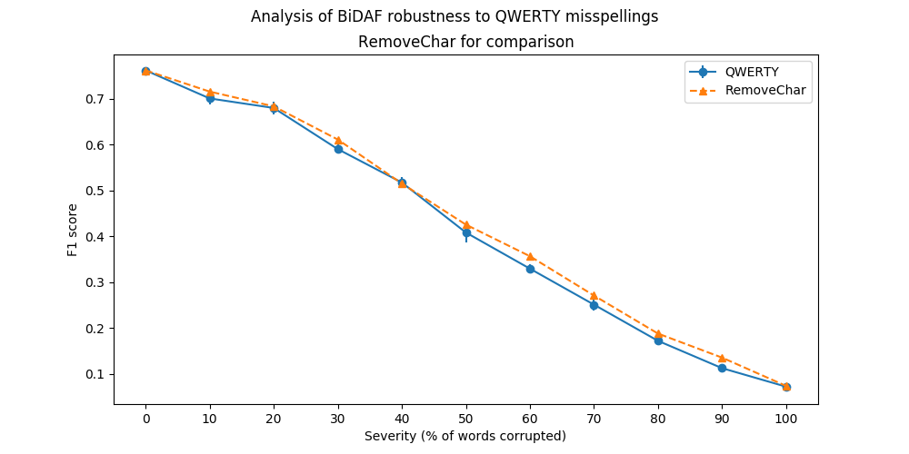

# Evaluation of BiDAF robustness.
This is an example of robustness evaluation. We use trained [BiDAF](https://arxiv.org/abs/1611.01603) model
and [SQuAD (v.1)](https://rajpurkar.github.io/SQuAD-explorer/) dataset to measure F1 scores under
different levels of text corruption severity. 

## Evaluation details
The full script is available in this repository, see the [evaluation.py](evaluation.py).
Below we provide excerpts from it.

### Retrieving resources
```python
import allennlp
import requests

data = requests.get(
            'https://rajpurkar.github.io/SQuAD-explorer/dataset/dev-v1.1.json')

BiDAF =\
    allennlp.predictors.predictor.Predictor.from_path(
        "https://s3-us-west-2.amazonaws.com/allennlp/models/bidaf-model-2017.09.15-charpad.tar.gz")
```

### Controlling corruption severity
We evaluate the model's robustness using the **RemoveChar** and **QWERTY** aspects separately.
Severity is defined as percentage of words corruption will be applied to. Percentage of characters
being modified is constant and equal to 20%. 

```python
def evaluate(squad_obj, score_func, predict_func, aspect):


    for severity in range(0, 100, 10):
        aspect_obj = aspect(words_percentage=severity)
        means = []
        for _ in range(3):
            modified = squad_obj.apply(aspect_obj)
            f1_scores = ...
            means.append(np.mean(f1_scores))

        results.append(np.mean(means), np.std(means))

    return results
```

### Results reporting
We repeat evaluation on multiple versions of randomly corrupted text with the same level of severity
and report average F1 score and standard deviation of F1 scores calculated on each run.

#### BiDAF resilience to characters removal
  

Underlying data is available here: [remove_char.csv](outputs/remove_char.csv)

#### BiDAF resilience to QWERTY misspellings
  

Underlying data is available here: [qwerty.csv](outputs/qwerty.csv)

## Notes
The script downloads resources from third parties.
It may break any time when those resources will be no longer available.

In this example we use only subset of data. The processing should take up to an hour.